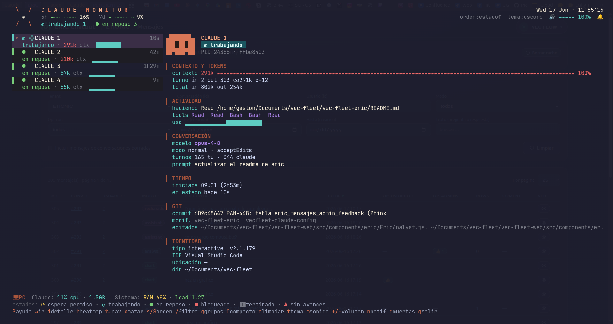

# Claude Monitor

Monitor en vivo, estilo `htop`, de tus sesiones de [Claude Code](https://claude.com/claude-code).
Una TUI con colores, mascota animada y sonidos chiptune 8-bit que te muestra qué está
haciendo cada sesión, cuáles esperan permiso, su uso de contexto, git, CPU/RAM y más.

 



## Características

- **Layout maestro-detalle de dos paneles**: a la izquierda la lista de sesiones como
  tarjetas; a la derecha el detalle en vivo de la seleccionada (contexto, tokens,
  actividad, conversación, git, identidad).
- **Estados en vivo**: trabajando · en reposo · espera permiso · bloqueado · terminada,
  con leyenda y ayuda (`?`).
- **Nombre de sesión** (`--name`, título auto-generado, o carpeta), actividad actual y directorio.
- **Uso de contexto (CTX)** por sesión, con aviso al acercarse al límite.
- **Modelo de Claude** en uso, destacado en el detalle de cada sesión.
- **Aviso de cuelgue** (`⚠ sin avances`) cuando una sesión lleva >3 min trabajando sin
  cambiar de estado, tanto en la tarjeta como en el detalle.
- **Heatmap de actividad** por hora del día (tecla `h`).
- **git** (rama + cambios), **CPU/RAM** y **uptime** de cada sesión.
- **Cuota** de tokens 5h / 7d con barras.
- **Sparkline de actividad** (USO) por sesión.
- **Alertas**: notificaciones de escritorio (con el logo de Claude) + sonidos chiptune
  distintos por evento, y un tono propio por sesión para los permisos.
- **Stats del sistema** en el pie: CPU/RAM de Claude + RAM/carga de la PC.
- **Navegación** con teclado, ir a la sesión (tmux/wmctrl), matar, filtrar, agrupar,
  ordenar, temas, mute de sonido/notificaciones.
- Modos no interactivos: `--once`, `--json`, `--status` (para tmux/waybar).

## Uso

```bash
./claude-monitor.py            # TUI, refresco 1s
./claude-monitor.py 2          # cada 2s
./claude-monitor.py --once     # un frame y sale
./claude-monitor.py --json     # JSON de todas las sesiones
./claude-monitor.py --status   # ◐1 ●4  (para statusline)
```

### Instalar como comando global

```bash
ln -sf "$PWD/claude-monitor.py" ~/.local/bin/claude-monitor
claude-monitor
```

## Teclas

| Tecla | Acción |
|---|---|
| `↑↓` / `j` `k` | navegar |
| `Enter` | ir a la sesión (tmux / ventana) |
| `i` | detalle a pantalla completa (inspector) |
| `h` | heatmap de actividad por hora |
| `?` | ayuda / leyenda de estados e iconos |
| `x` | matar la sesión seleccionada (con confirmación) |
| `s` / `S` | cambiar campo de orden / invertir |
| `/` | filtrar |
| `g` | agrupar por proyecto |
| `C` | modo compacto |
| `c` | limpiar sesiones muertas |
| `t` | cambiar tema (oscuro / claro / contraste) |
| `m` | activar/silenciar sonidos |
| `n` | activar/silenciar notificaciones |
| `d` | mostrar/ocultar sesiones muertas |
| `q` / `Ctrl+C` | salir |

## Configuración (variables de entorno)

- `CLAUDE_CONFIG_DIR` — carpeta de config de Claude (por defecto `~/.claude`).
- `CLAUDE_MON_SND_*` — overrides de sonidos (ver código).

## Requisitos

- Python 3.8+ (solo stdlib).
- Terminal con truecolor (recomendado).
- Opcionales: `notify-send` (notificaciones), `paplay`/`pw-play`/`aplay` (sonidos),
  `tmux` o `wmctrl` (saltar a la sesión).

## ¿Consume tokens de Claude?

**No.** El monitor **no** hace ninguna llamada a la API de Claude ni gasta cuota.
Funciona 100 % en local leyendo los archivos que Claude Code ya escribe en disco
(`~/.claude/sessions/*.json` y `~/.claude/projects/*/<id>.jsonl`). Las cifras de
**tokens** que se muestran (contexto por sesión, uso del turno, y la cuota **5h / 7d**)
se **leen** de esos archivos de uso/transcript; el monitor solo los lee y los grafica,
no genera tráfico ni costo.

## Cómo funciona

Lee los archivos de sesión de `~/.claude/sessions/*.json` y el historial
`~/.claude/projects/*/<id>.jsonl` para extraer actividad, modelo y uso de contexto.
Los sonidos 8-bit se sintetizan al vuelo y se cachean en `~/.claude/monitor-sounds/`.
